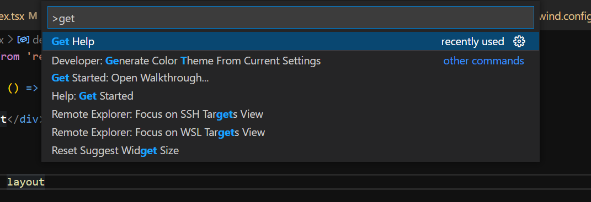
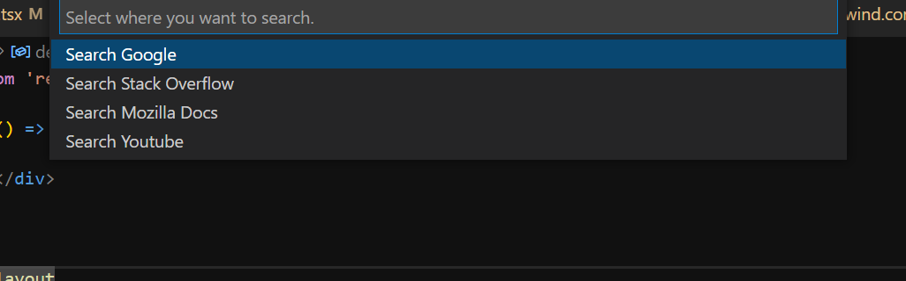
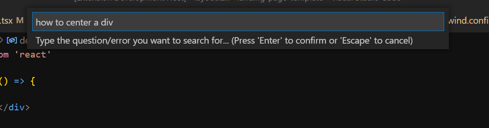

## Instructions

  

Select the *Get Help* Command

 
 

Select where you want to search

 
 

Type your question/error in the inputBox and press enter.

 

> Note: the inputBox will be populated with your clipboard text automatically

---

**Enjoy!**
